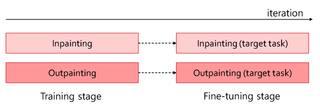
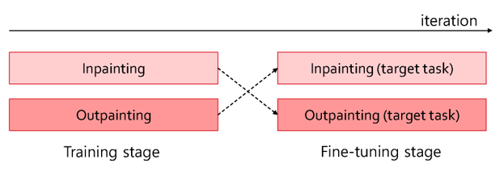

# [In-N-Out: Towards Good Initialization for Inpainting and Outpainting](https://arxiv.org/abs/2106.13953)
## Introduction
<p> </p>
<p></p>

Our method provides general approach to improve inpainting or outpainting networks. Simply, if your target task is inpainting, train your network with outpainting task first. Otherwise, train your network with inpainting task first. For an implementation directly into your network, it's enough to write mask = 1 - mask during the training itrations of your first half.

<p> </p>
<p> </p>

You can find more results in our supplement (to be uploaded).

## Installation
Tested on CUDA 10.2, ubuntu 16.04 (or 18.04) docker environment.\
Please make an environment using In_N_Out_environment.txt, and then install below things more.
```sh
apt install libgl1-mesa-glx libopenexr-dev
pip install tensorflow-gpu==1.15.0 
pip install tensorflow==1.15.0
pip install opencv-python==4.4.0.44
pip install scipy==1.5.3
pip install easydict==1.9
pip install future==0.18.2
pip install natsort==7.1.0
pip install scikit-image==0.17.2

# please unzip folders to /root/In_N_Out/ablation_study.
https://drive.google.com/drive/folders/1EOr3Id_8tDjefJmDKOKIk1y8K_ZYGTiI?usp=sharing
```

Below instructions assume that you have downloaded our folder to "/root/In_N_Out".
For CUB200 dataset, we downloaded from http://www.vision.caltech.edu/visipedia/CUB-200-2011.html and cropped using given bboxes. For train/test split, please refer to our text files (/root/In_N_Out/ablation_study/CUB-200-2011/train_10000.txt, /root/In_N_Out/ablation_study/CUB-200-2011/test_1788.txt).

For CelebA dataset, we downloaded from https://github.com/suvojit-0x55aa/celebA-HQ-dataset-download. For train/test split, please refer to our text files (/root/In_N_Out/ablation_study/CUB-200-2011/train.txt, /root/In_N_Out/ablation_study/CUB-200-2011/val.txt). Here we use validation set for testing. For the test masks, we use given bboxes again, to 'mask' cropped images. This let us reproduce the test masks easily (rather than not-shared 128x128 random test masks), and explore masks with various difficulty. The test masks are provided in /root/In_N_Out/ablation_study/celebA/mask256x256. Please refer to our supplementary material for more details. 

## Training
```sh
# You can fix data_file, checkpoints_dir, specific_model_folder, load_model_dir in each shell 
# if you installed in another folder (not "/root/In_N_Out")

cd ~/In_N_Out/ablation_study
Inpainting task - baseline: ./scripts/scripts_ldr_batch8/cub200_baseline.sh
Inpainting task - In-N-Out: ./scripts/scripts_ldr_batch8/cub200_out.sh

Outpainting task - baseline: ./scripts/scripts_ldr_batch8_out/train_celebA_baseline.sh
Outpainting task - In-N-Out: ./scripts/scripts_ldr_batch8_out/train_celebA_in.sh
```

## Testing
```sh
# You can fix test_*.sh if you installed in another folder (not "/root/In_N_Out")
# Last iteration
cd ~/In_N_Out/ablation_study
Inpainting task - ./test_in_40000.sh
Outpainting task - ./test_out_45000.sh
# Every 500 iterations 
cd ~/In_N_Out/ablation_study
Inpainting task - ./test_in_all.sh
Outpainting task - ./test_out_all.sh

# Also, You can check tensorboard like this.
tensorboard --logdir ./checkpoints/checkpoint_ldr/baseline_batch8

# Weight files for results in our paper
https://drive.google.com/drive/folders/1EOr3Id_8tDjefJmDKOKIk1y8K_ZYGTiI?usp=sharing
```

## Citation
If our In-N-Out concept is useful to you, please consider citing
```sh
# will be updated after BMVC 2021
@misc{jo2021innout,
      title={In-N-Out: Towards Good Initialization for Inpainting and Outpainting}, 
      author={Changho Jo and Woobin Im and Sung-Eui Yoon},
      year={2021},
      eprint={2106.13953},
      archivePrefix={arXiv},
      primaryClass={cs.CV}
}
```

## Acknowledgments
Our code is built upon Wide-Context Semantic Image Extrapolation (https://github.com/dvlab-research/outpainting_srn). Thanks for the work!
